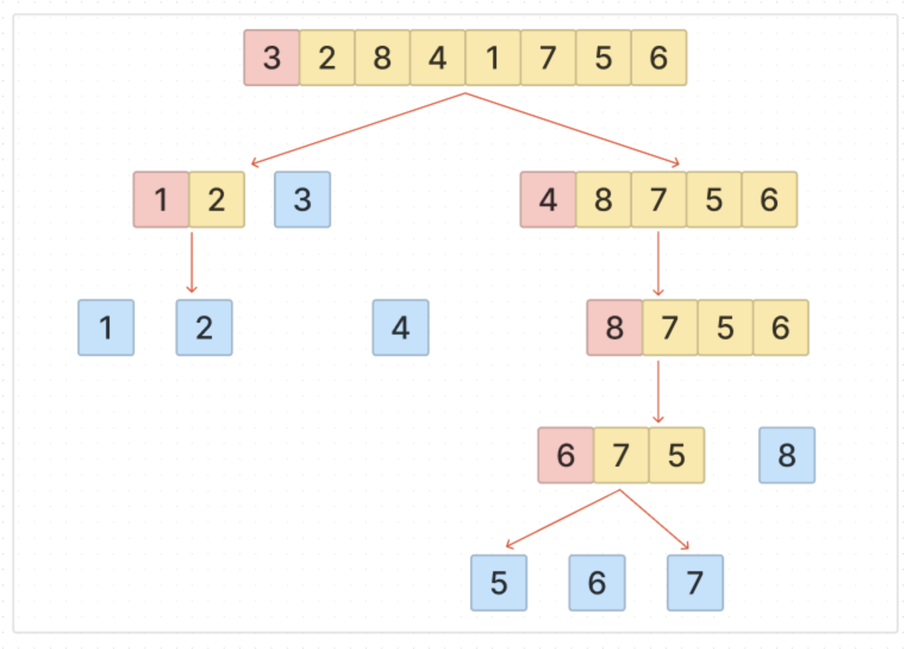

안전 정렬 : 동일한 값에 기존 순서가 유지 (버블, 삽입)

불안정 정렬 : 동일한 값에 기존 순서가 유지X (선택,퀵)

### 퀵소트

불안정 정렬,

---

```c++
퀵소트는 최악의 경우 O(n^2), 평균적으로 Θ(nlogn)을 가짐

#include <stdio.h>

int data[10] = {4, 1, 2, 3, 9, 7, 8, 6, 10, 5};

void quick_sort(int *data, int start, int end){
    if(start >= end){
        // 원소가 1개인 경우
        return;
    }

    int pivot = start;
    int i = pivot + 1; // 왼쪽 출발 지점
    int j = end; // 오른쪽 출발 지점
    int temp;

    while(i <= j){
        // 포인터가 엇갈릴때까지 반복
        while(i <= end && data[i] <= data[pivot]){
            i++;
        }
        while(j > start && data[j] >= data[pivot]){
            j--;
        }

        if(i > j){
            // 엇갈림
            temp = data[j];
            data[j] = data[pivot];
            data[pivot] = temp;
        }else{
            // i번째와 j번째를 스왑
            temp = data[i];
            data[i] = data[j];
            data[j] = temp;
        }
    }

    // 분할 계산
    quick_sort(data, start, j - 1);
    quick_sort(data, j + 1, end);
}

int main(void){
    quick_sort(data, 0, 9);

    // 결과 확인
    for(int i=0; i<10; i++){
        printf("%d ", data[i]);
    }

    return 0;
}

```



피벗 선택 방식 : 첫번째, 중간, 마지막, 랜덤
(선택 방식에 따라 속도가 달라지므로 중요함)

1. 피벗 선택
2. 오른쪽(j)에서 왼쪽으로 가면서 피벗보다 작은 수 찾음
3. 왼쪽(i)에서 오른쪽으로 가면서 피벗보다 큰 수 찾음
4. 각 인덱스 i, j에 대한 요소를 교환
5. 2,3,4번 과정 반복
6. 더이상 2,3번 진행이 불가능하면, 현재 피벗과 교환
7. 이제 교환된 피벗 기준으로 왼쪽엔 피벗보다 작은 값, 오른쪽엔 큰 값들만 존재함

---

버블정렬은 모든 배열의 요소에 대한 인덱스를 하나하나 증가하며 비교해나가는 O(n^2)

퀵정렬의 경우 인접한 것이 아닌 서로 먼 거리에 있는 요소를 교환하면서 속도를 줄일 수 있음

But, **피벗 값이 최소나 최대값으로 지정되어 파티션이 나누어지지 않았을 때** O(n^2)에 대한 시간복잡도를 가짐

#### 퀵소트 O(n^2) 해결 방법

---

이런 상황에서는 퀵소트 장점이 사라지므로, 피벗을 선택할 때 `중간 요소`로 선택하면 해결이 가능함

```c++
int partition(vector<int>& array, int left, int right) {
    int mid = (left + right) / 2;
    swap(array[left], array[mid]);
    int pivot = array[left];
    int i = left + 1;
    int j = right;

    while (i <= j) {
        while (i <= j && array[i] <= pivot) {
            i++;
        }
        while (i <= j && array[j] > pivot) {
            j--;
        }
        if (i < j) {
            swap(array[i], array[j]);
        }
    }

    swap(array[left], array[j]);

    return j;
}

}
```

이는 다른 O(nlogn) 시간복잡도를 가진 소트들보다 빠르다고 알려져있음

> 먼거리 교환 처리 + 캐시 효율(한번 선택된 기준은 제외시킴)
